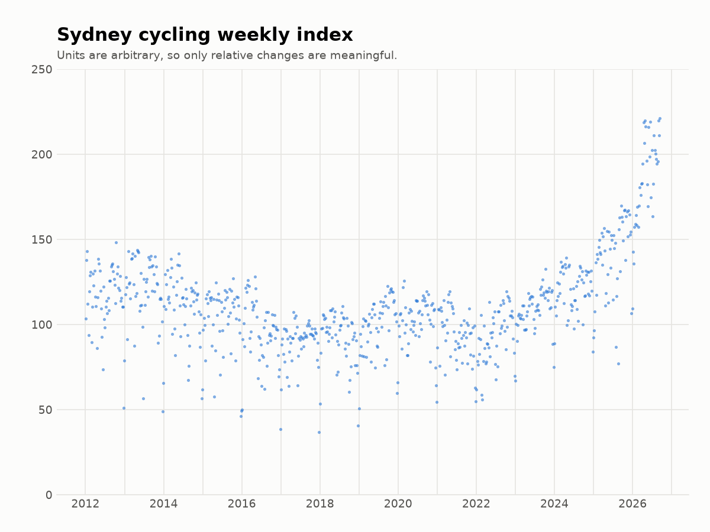
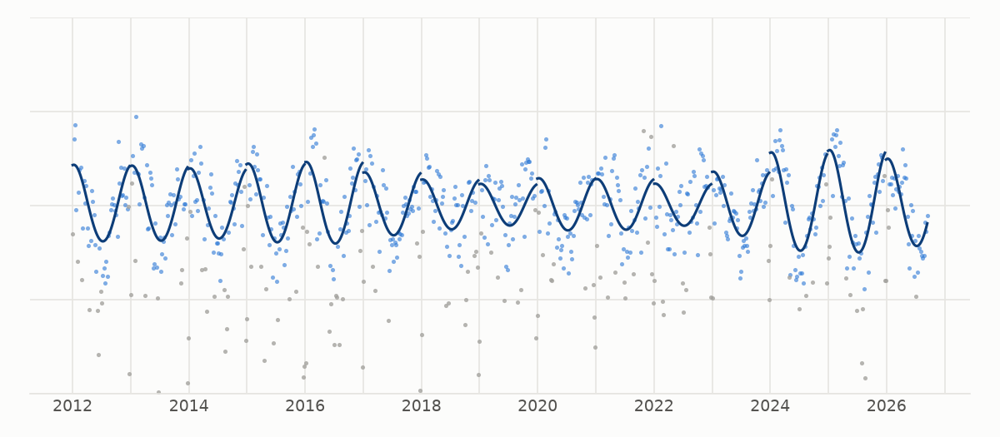

It feels like cycle paths have been becoming busier, but I found it hard to tell exactly how much so. TfNSW has a cycling counts dashboard at https://www.transport.nsw.gov.au/projects/programs/walking-and-cycling-program/walking-and-cycling-counts, but it only shows a naive average over counters, which isn’t robust to e.g. counters being added in less popular areas.

So, I made this plot. It merges all City of Sydney cycling counters in a robust way and removes seasonal variation.

## Methodology

Data is from TfNSW: https://www.transport.nsw.gov.au/projects/programs/walking-and-cycling-program/walking-and-cycling-counts

There is one dot per week. The index value at time $t$ is

$$
f(t)\coloneqq \operatorname{median}_i [x_i(t) - s_i],
$$

where $x_i(t)$ is the $i$th counter's log(total) for week $t$ and $s_i$ is the 'size' of the
$i$th counter. We choose $s_i$ so that

$$
\operatorname{mean}_t [x_i(t) - s_i] = \operatorname{mean}_t f(t).
$$

Intuitively, we want to normalise each counter by its size, and we want the size of a counter to be calculated in a way
that isn't affected by how popular cycling was when the counter was active.

After calculating the raw index, we adjust for seasonal effects by fitting the sum of a linear spline and a 365-day-period sine wave and subtracting
only the sine wave from the raw index. Finally we exponentiate to get back out of log-space.

The following plot shows in the solid blue line the adjustment which we subtract from the raw index. The data points are the raw index points minus the linear spline factor, and the grey dots are outliers excluded from the fit.

