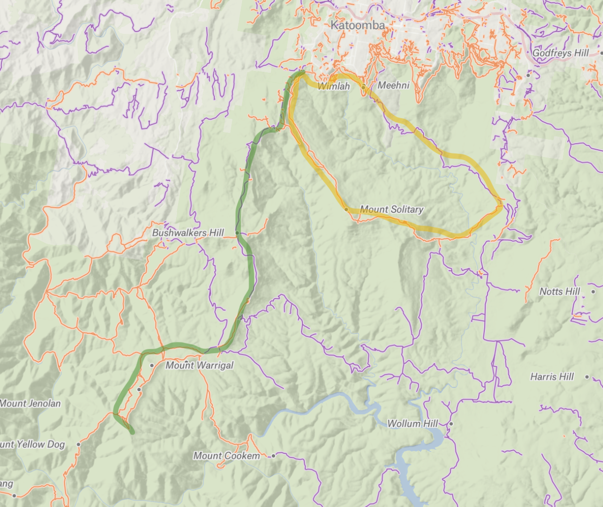

This blog has many walks around Sydney: https://hikingtheworld.blog/hiking-guides/overnight-walks-near-sydney/

## Mount Solitary Loop

Overnight. Starts and ends at Katoomba.

Day 1: Descend into the valley, follow Federal Pass west, then Ruined Castle Walking Track. Camp at Chinaman's Gully or elsewhere on the plateau.

Day 2: Follow the Mount Solitary ridge line down to Sublime Point Trail, and walk back to Federal Pass. Depending on where you camp this last day can be quite long, so leave early.

The only reliable source of water is at Kedumba River on the second day, so bring plenty of water.

## Splendour Rock via Narrow Neck

Overnight. Starts and ends at Katoomba.

Day 1: Cycle down Narrow Neck, dump bikes at the lookout. Take Taros Ladder or Duncans Pass down and follow the track to the walk's best water source, at Mobbs Soak.

Take the path left of the toilet and continue until you see a cairn marking a left turn onto the trail up to Mount Dingo. Camp anywhere before Splendour Rock.

Day 2: The reverse.

There is apparently a place upstream at Mobbs to get water, but we couldn't find it, so we got water here from a small drip below the boardwalks before the campsite.

The trail near Mobbs Soak was very leechy in late March.

There's an alternate route that goes up over the ridge line, instead of alongside it, starting from the end of the fire trail, but we were advised against it by some other trampers. Apparently it's quite overgrown. On the second day we checked out the trail at the Mount Dingo side, and it seemed ok there.
